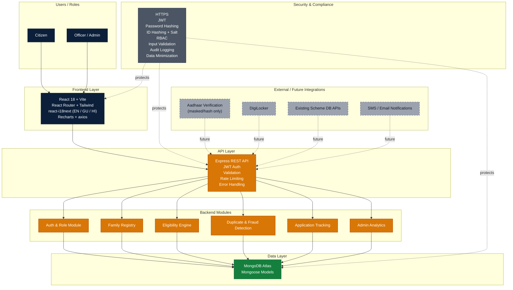
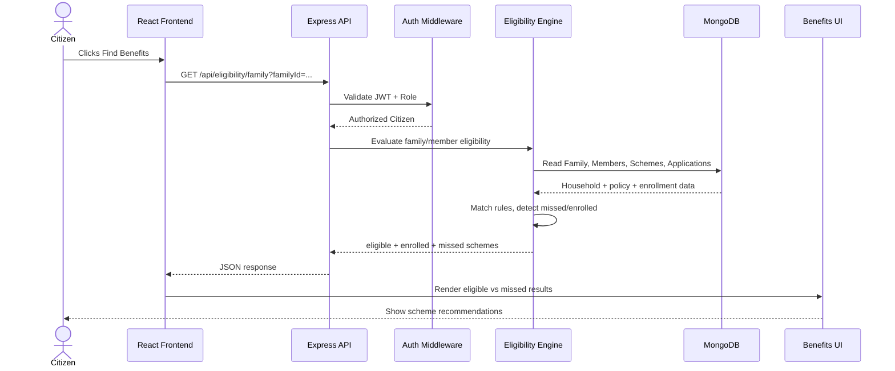
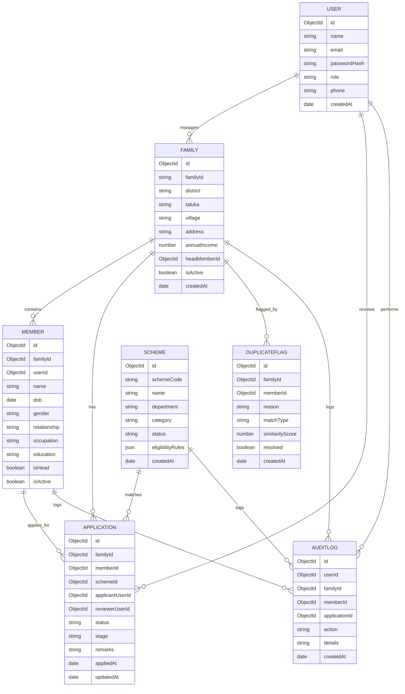

# ParivarSathi Architecture

## 1) High-level system architecture

## 2) Request flow: Citizen clicks Find Benefits

## 3) Data model / ER diagram

## 5-line deployment plan

1. Build the frontend around citizen and officer dashboards with role-based access.
2. Keep the backend modular so eligibility, duplicate checks, and analytics remain independent.
3. Store family and member data in MongoDB with a normalized join model for applications.
4. Add security controls at the API and data layer before production rollout.
5. Deploy frontend to Vercel and backend to Render, with MongoDB Atlas as the persistent data store.
